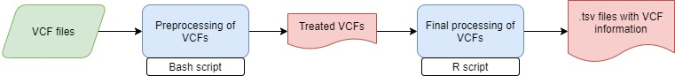

# **nf_variantes_ldg**

Nextflow pipeline that takes a VCF file and convert it 
in a .tsv files for easy manipulation 

------------------------------------------------------------------------

### Workflow overview

------------------------------------------------------------------------

## Requirements

#### Compatible OS\*:

-   [Ubuntu 18.04 ](http://releases.ubuntu.com/18.04/)

#### Software:

|                    Requirement                     |          Version           |  Required Commands \*  |
|:--------------------------------------------------:|:--------------------------:|:----------------------:|
|        [Nextflow](https://www.nextflow.io/)        |          21.04.2           |        nextflow        |
|          [R](https://www.r-project.org/)           |           4.0.5            |   \*\* See R scripts   |
| [VCFtools](http://vcftools.sourceforge.net/)       |           0.1.15           | \*\*See bash code      |
| [BCFtools](samtools.github.io/bcftools/bcftools.html) |           1.7           | \*\*See bash code      |

\* These commands must be accessible from your `$PATH` (*i.e.* you
should be able to invoke them from your command line).

### Installation

Download nf_variantes_ldg from Github repository:

    git clone git@github.com:fernanda-miron/nf-variantes-ldg.git

------------------------------------------------------------------------

#### Test

To test nf_variantes_ldg execution using test data, run:

    ./runtest.sh

Your console should print the Nextflow log for the run, once every
process has been submitted, the following message will appear:

     ======
     Basic pipeline TEST SUCCESSFUL
     ======

results for test data should be in the following file:

    nf_variantes_ldg/test/results/final_vcfs

------------------------------------------------------------------------

### Usage

To run with your own data go to the pipeline directory and execute:

    nextflow run wrangling.nf --vcf_path <path to input 1> --output_dir <path to input 2> [--output_dir path to results ]

For information about options and parameters, run:

    nextflow run wrangling.nf --help

------------------------------------------------------------------------

#### Authors

Israel Aguilar Ordonez
Maria Fernanda Miron T
# nf-demographic-modelling
